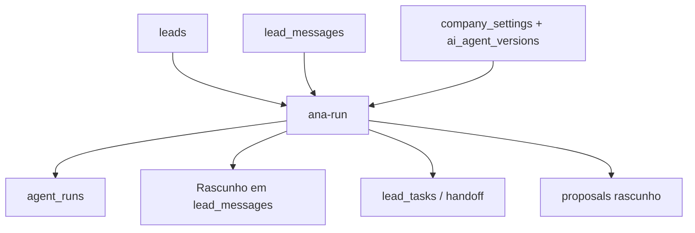

# Ana — funil operacional

## Mapa real do projeto

| Já existe | Complementado nesta entrega |
| --- | --- |
| `leads`, `lead_messages`, `lead_tasks`, `appointments`, `proposals`, `company_settings`, `ai_agents` e `ai_agent_versions` | `modo_atendimento`, `ana_stage`, `ana_outcome` e a trilha `agent_runs` |
| Kanban em `src/pages/dashboard/kanban` e drawer do lead | Funil único: Novo → Apresentado → Qualificando → Reunião → Orçamento → Ganho/Perdido; botão **Rodar Ana** e timeline de execuções |
| Central de Atendimento e integrações por organização | Evento `message.received` cria rascunho auditável; nunca envia pelo navegador |
| Personalização da Ana | A publicação alimenta `company_settings.ai_prompt` e a versão ativa de `ai_agent_versions` |
| `automation-worker` e telemetria WhatsApp | Execução segura de timeouts de 48h pelo botão **Executar automações**; cria handoff, não fecha o lead automaticamente |

## Comportamento aplicado

`ana-run` usa OpenAI como provedora principal e Claude como alternativa somente no servidor. Ela monta o contexto com os registros da organização, exige uma saída JSON estruturada dos dois provedores, valida a decisão e impede salto de etapa. Em modo `humano`, em timeout de 48h ou em handoff, não cria mensagem automática.

O canal ainda não é um envio real nesta função: quando estiver indisponível, a mensagem fica com `pending_channel`; quando estiver conectado, fica como `draft`, sempre para revisão. Orçamentos nascem `pending` com `need_approval=true`.

## Checklist de teste nas telas atuais

- [ ] Em **Leads**, crie ou selecione um lead, atribua responsável e escolha **IA** ou **Humano** antes de enviá-lo ao Kanban.
- [ ] Em **Kanban**, confira as seis colunas e abra um lead. Na aba **Ana**, clique em **Rodar Ana**.
- [ ] Sem `OPENAI_API_KEY` e `CLAUDE_API_KEY`, confirme que a aba Ana exibe erro e que o lead não é alterado.
- [ ] Com uma das chaves configurada no secret do Supabase, confirme uma entrada em **Ana → Execuções** e um rascunho na **Central de Atendimento**.
- [ ] Coloque um lead em `HUMANO` e confirme que **Rodar Ana** fica indisponível e que uma mensagem recebida não cria envio automático.
- [ ] Em **Kanban → Executar automações**, confirme que leads vencidos há 48h recebem tarefa de revisão humana, sem ir para Perdido automaticamente.
- [ ] Em **Configurações → Personalização da Ana**, salve uma alteração e confirme que uma nova versão é criada em `ai_agent_versions`.

## Operação pendente de credencial

Para gerar respostas reais, configure `OPENAI_API_KEY` e/ou `CLAUDE_API_KEY` nos secrets do projeto Supabase. A OpenAI é priorizada; o Claude é usado quando a OpenAI não está configurada ou sofre indisponibilidade temporária. Use `CLAUDE_MODEL` somente se quiser substituir o modelo padrão `claude-sonnet-5`. O arquivo `.env.example` registra somente os nomes das variáveis; nenhuma chave é exposta no repositório. O agendamento externo recorrente do worker exige um segredo de automação no ambiente; até ele ser configurado, o mesmo processamento pode ser executado com segurança pelo botão do Kanban.
